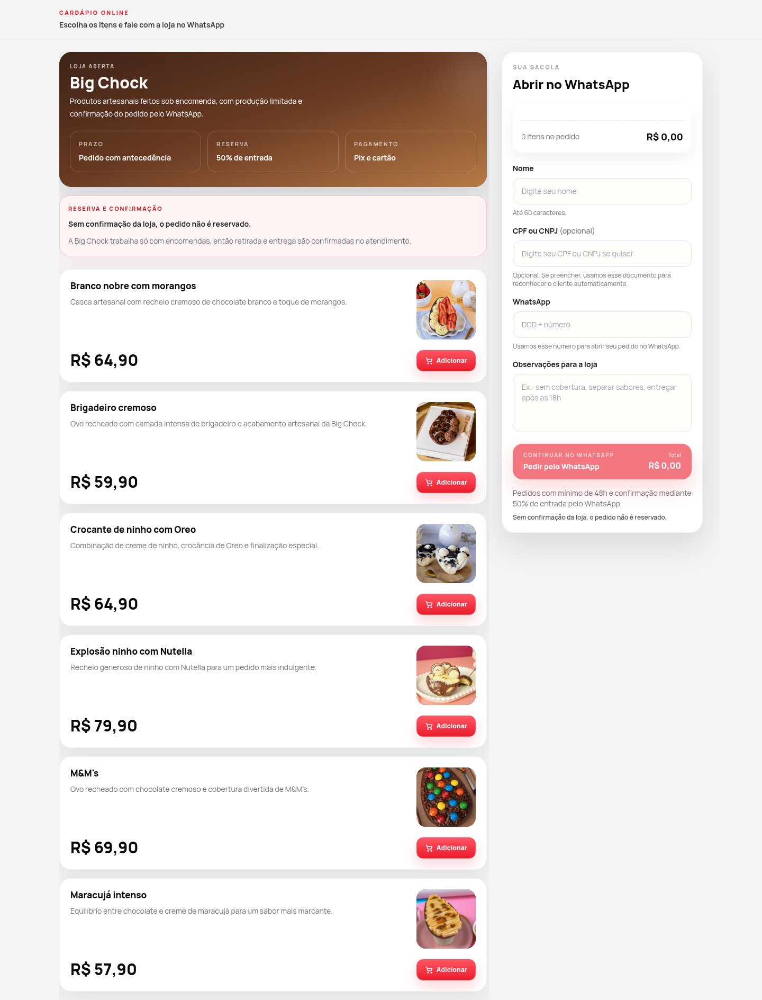
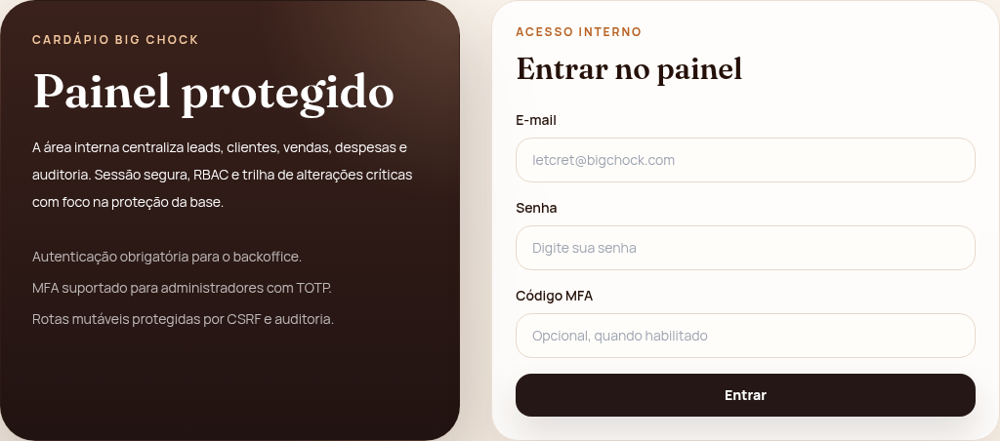
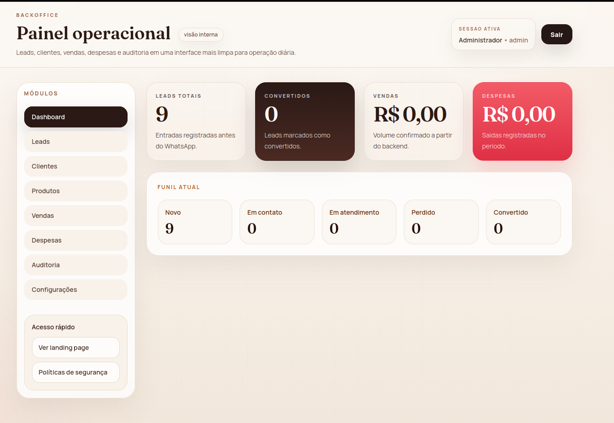

# Big Chock

Projeto web desenvolvido para a **Big Chock**, com foco em apresentação de produtos, captação de leads e direcionamento de pedidos via **WhatsApp**.

A solução foi pensada para unir uma experiência simples para o cliente com uma estrutura interna de acompanhamento operacional.





---

## 📌 Sobre o projeto

O **Big Chock** é um catálogo online com fluxo de atendimento comercial via WhatsApp.

O usuário acessa a landing page, visualiza os produtos e, ao iniciar o contato, o sistema registra o lead antes do redirecionamento.  
Além da parte pública, o projeto conta com um painel interno para gestão operacional.

---

## 🚀 Principais funcionalidades

- Catálogo online com foco em navegação simples e objetiva
- Landing page mobile-first
- Registro de lead antes do redirecionamento para o WhatsApp
- Fallback para WhatsApp caso a API esteja indisponível
- Painel administrativo com autenticação
- Dashboard operacional
- Gestão de leads
- Gestão de clientes
- Gestão de produtos
- Controle de vendas
- Controle de despesas
- Auditoria de ações
- Controle de acesso por perfil (RBAC)

---

## 🧱 Estrutura do projeto

```txt
frontend/  -> landing page pública + painel interno em React/Vite/Tailwind
server/    -> API Express + MongoDB + autenticação + auditoria
```

---

## 🛠️ Tecnologias utilizadas

### Frontend
- React
- Vite
- Tailwind CSS
- React Router DOM

### Backend
- Node.js
- Express
- MongoDB
- Mongoose
- JWT
- Zod

### Segurança e apoio
- Helmet
- Express Rate Limit
- CSRF
- Honeypot anti-bot
- RBAC
- Auditoria

---

## 🔄 Fluxo principal

1. O usuário acessa a landing page
2. Visualiza os produtos disponíveis
3. Inicia o contato via WhatsApp
4. Antes do redirecionamento, o sistema registra o lead
5. O time interno pode acompanhar os dados pelo painel operacional

---

## 📚 Aprendizados com o projeto

Esse projeto foi importante para consolidar prática em:

- desenvolvimento full stack
- organização de fluxo comercial
- integração entre frontend e backend
- captação e acompanhamento de leads
- segurança básica de aplicação web
- estruturação de painel administrativo
- deploy distribuído em múltiplos serviços

---

## 👨‍💻 Autor

Desenvolvido por **Herberth Amorim**  
GitHub: [sm7f](https://github.com/sm7f)
